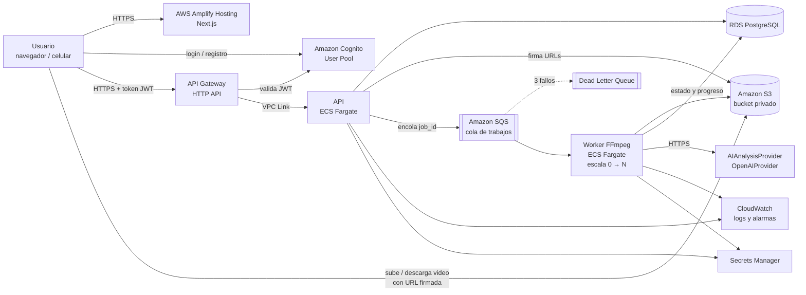
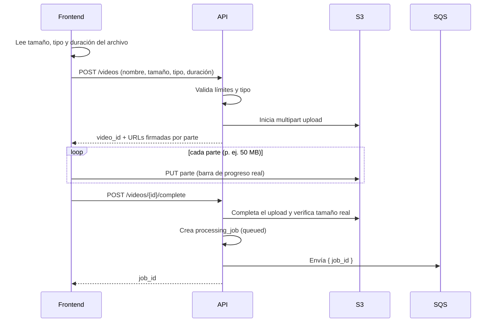
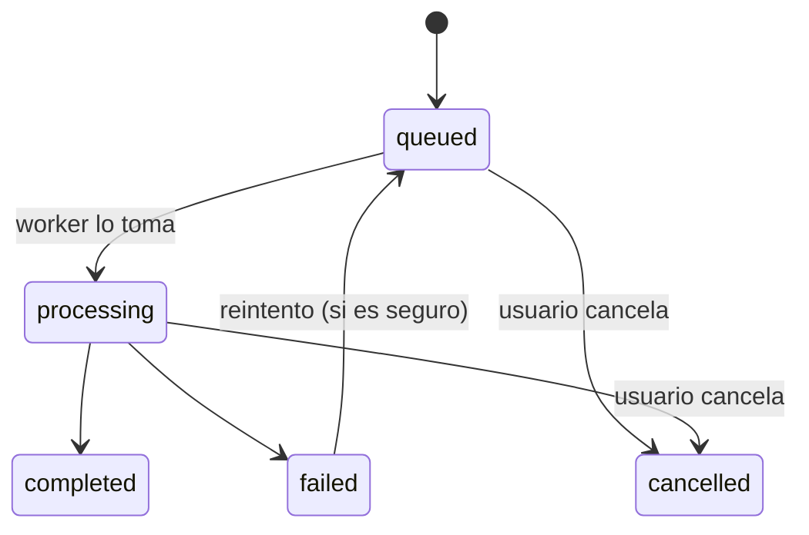
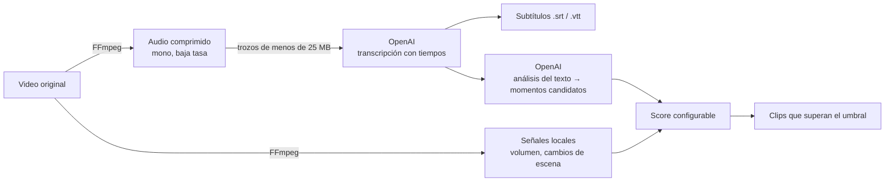
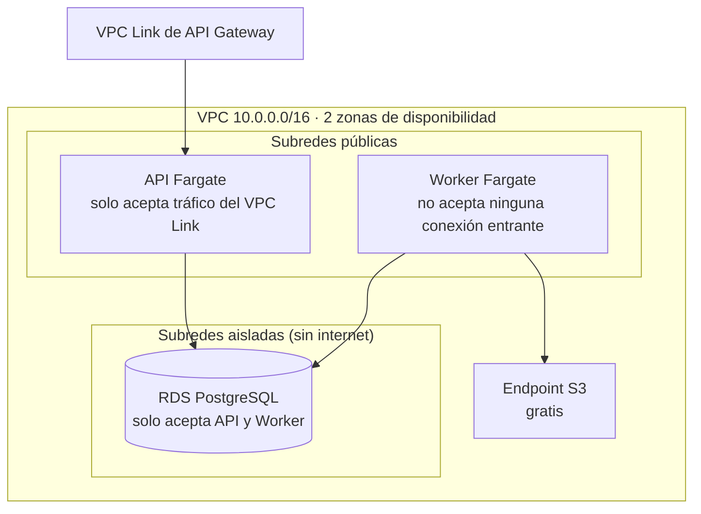

# ClipFlow — Fase 2: Arquitectura sobre AWS

Región: `us-east-1` · Lenguaje: TypeScript en todo · IaC: AWS CDK

> Este documento describe **cómo se conecta todo**. Nada de esto está desplegado todavía:
> cada pieza se crea con código (CDK) en las fases siguientes.

---

## 1. Vista general



## 2. Cada pieza y por qué

| Pieza | Servicio AWS | Qué hace | Por qué esta opción |
|---|---|---|---|
| Frontend | **Amplify Hosting** | Sirve la app Next.js con HTTPS | Soporta Next.js con SSR de forma administrada; se conecta a GitHub y despliega solo; dominio propio con un clic |
| Entrada de la API | **API Gateway (HTTP API)** | Recibe las peticiones, valida el token de Cognito, limita el tráfico | Da HTTPS **sin necesitar dominio**, trae rate limiting y validación JWT incluidos, y es más barato que un Load Balancer para empezar |
| API | **ECS Fargate** (contenedor Node.js + Fastify) | Usuarios, proyectos, uploads, jobs, clips, exports, créditos | Contenedor normal: el mismo código corre en tu computadora y en AWS; sin límites de Lambda |
| Worker de video | **ECS Fargate** (contenedor con FFmpeg) | Procesa videos: analiza, recorta, 9:16, thumbnails, subtítulos | Hasta 16 vCPU, 120 GB RAM y 200 GB de disco; sin límite de 15 min. **Se apaga cuando la cola está vacía (0 tareas = $0)** |
| Cola | **SQS** + Dead Letter Queue | Guarda los trabajos pendientes | Si un worker muere, el trabajo vuelve a la cola; tras 3 fallos va a la DLQ y se genera una alarma |
| Base de datos | **RDS PostgreSQL 16** | Datos de usuarios, proyectos, jobs, clips, créditos | Requisito. Sin acceso desde internet |
| Archivos | **S3** (un bucket privado) | Videos, clips, thumbnails, subtítulos, exports | Barato, ilimitado, URLs firmadas que caducan |
| Autenticación | **Cognito User Pool** | Registro, login, verificación de email, recuperar contraseña | AWS guarda y protege las contraseñas; Google se agrega después como proveedor |
| Secretos | **Secrets Manager** | Contraseña de la BD y clave de OpenAI | Nunca en GitHub ni en el frontend |
| Logs | **CloudWatch** | Logs de API y worker, métricas, alarmas por email | Todo en un sitio, sin instalar nada |
| Imágenes Docker | **ECR** | Guarda las imágenes de API y worker | Registro privado de AWS |
| Dominio (después) | **Route 53 + ACM** | `clipflow.com`, `api.clipflow.com` | Certificados HTTPS gratis; opcional para desarrollar |

**Descartado a propósito**

- **Lambda para video**: 15 min máximo y 10 GB de disco: no sirve para videos largos.
- **Application Load Balancer** (por ahora): ~16 USD/mes fijos y para HTTPS necesita un dominio. API Gateway lo reemplaza. Si el tráfico crece mucho, se cambia sin tocar el código de la API.
- **EC2** para el worker: habría que administrar servidores. Fargate hace lo mismo sin mantenimiento.

## 3. Flujos principales

### 3.1 Registro e inicio de sesión

1. El frontend usa la librería oficial de AWS Amplify (Auth) para hablar con Cognito.
2. Cognito envía el código de verificación por email.
3. Al iniciar sesión, Cognito entrega tokens (JWT). Se guardan en **cookies seguras** para que Next.js
   pueda proteger páginas en el servidor.
4. Cada llamada a la API lleva el token. **API Gateway** lo valida y **la API lo vuelve a validar**
   (doble control). El `sub` de Cognito es la identidad del usuario en la tabla `users`.

> Cognito envía emails con su remitente por defecto (límite ~50/día). En producción se conecta
> **Amazon SES** con tu dominio (Fase 10/11).

### 3.2 Subir un video (directo a S3)



- **Multipart** permite archivos grandes (más de 5 GB) y reintentar una parte si falla la conexión.
- El video **nunca pasa por la API**: la API solo firma URLs.
- El worker vuelve a verificar el archivo con `ffprobe` (contenido real, no solo la extensión).
  Si no es un video válido, el job falla con un mensaje claro y el archivo se marca como rechazado.

### 3.3 Procesar (asíncrono)



Dentro de `processing`, el job guarda una **etapa** y un **porcentaje reales**:

| Etapa (`stage`) | Qué pasa realmente |
|---|---|
| `preparing` | Descarga desde S3 y `ffprobe` |
| `analyzing` | Extrae audio y calcula señales (volumen, cambios de escena) |
| `detecting_moments` | Calcula el score de cada segmento y elige los momentos |
| `rendering_clips` | FFmpeg genera cada clip; el % sale del progreso real de FFmpeg y de cuántos clips van |
| `finalizing` | Sube resultados a S3 y guarda los registros |

**Idempotencia (no procesar dos veces):**

- El mensaje de SQS solo lleva `job_id`. Los datos viven en PostgreSQL.
- El worker **reclama** el job con una operación atómica:
  `UPDATE processing_jobs SET status='processing' ... WHERE id=$1 AND status='queued'`.
  Si otro worker ya lo tomó, esta no afecta ninguna fila y el mensaje se descarta.
- Mientras trabaja, el worker envía un "latido" (`heartbeat_at`) y extiende la visibilidad del
  mensaje en SQS. Si muere, el latido se detiene y el job puede recuperarse de forma segura.
- Los archivos de salida tienen rutas fijas por job (`clips/{job_id}/{n}.mp4`), así que repetir
  un paso sobrescribe en vez de duplicar.

**Progreso en el frontend:** consulta `GET /jobs/{id}` cada pocos segundos. Es simple y confiable.
Más adelante se puede cambiar a WebSocket sin cambiar el worker.

### 3.4 Revisar, editar y exportar

- Las previews y descargas usan **URLs firmadas de lectura** que caducan en ~15 min.
- Editar un clip (cambiar inicio o fin, formato, subtítulos) crea un **nuevo job de render**, que
  pasa por la misma cola.
- Exportar genera el archivo final en `exports/` y lo registra en la tabla `exports`.

## 3.5 Análisis con OpenAI (desde la primera versión)



- El worker **no envía el video completo** a OpenAI: solo el audio comprimido, en trozos,
  porque OpenAI limita el tamaño por petición. Es más barato y más rápido.
- La transcripción trae marcas de tiempo, así que los subtítulos son reales y quedan sincronizados.
- OpenAI sugiere momentos a partir del texto. Esa sugerencia es **una señal más** del score
  (`speech_signal`), junto con las señales de audio y video calculadas con FFmpeg. Así, un video
  sin voz (gameplay) también puede generar clips.
- Todo pasa por la interfaz `AIAnalysisProvider`: `transcribe()`, `analyze()` y
  `generateClipSuggestions()`. Cambiar de modelo o de proveedor no toca el resto del sistema.
- Los modelos se configuran por variable de entorno (se eligen al implementar, según precios
  vigentes).
- **Costos:** cada job guarda los minutos de audio enviados, los tokens usados y el costo estimado
  en `usage`, para calcular la rentabilidad por video.
- **Errores:** si OpenAI falla o no responde, se reintenta con espera creciente. Si sigue fallando,
  el job queda `failed` con el mensaje "El servicio de análisis no está disponible, reintenta
  más tarde", y se puede reintentar sin volver a subir el video.
- `MockAIProvider` se usa solo en tests automáticos. Nunca se muestran resultados simulados
  como si fueran reales.

## 4. Organización de S3

Un solo bucket privado con prefijos separados. Cada prefijo tiene sus propias reglas de vida:

| Prefijo | Contenido | Regla |
|---|---|---|
| `originals/{user_id}/{video_id}/` | Video subido | Se conserva |
| `tmp/{job_id}/` | Archivos intermedios | Se borran solos a las 24 h |
| `clips/{user_id}/{clip_id}/` | Clips generados | Se conserva |
| `thumbnails/{user_id}/{clip_id}/` | Imágenes | Se conserva |
| `subtitles/{user_id}/{clip_id}/` | `.srt` / `.vtt` | Se conserva |
| `exports/{user_id}/{export_id}/` | Archivos finales | Configurable (p. ej. 30 días) |

Además: bloqueo total de acceso público, cifrado, solo HTTPS, CORS únicamente para el dominio
del frontend y limpieza automática de uploads incompletos.

## 5. Red (VPC)



- **La base de datos no tiene salida a internet.** Solo aceptan conexión los contenedores de
  API y worker (security groups).
- **Sin NAT Gateway al inicio** (ahorra ~33 USD/mes). Los contenedores salen a internet
  (para llegar a SQS, Cognito y OpenAI) con IP pública, pero **ninguna conexión desde
  internet puede entrar**: el worker no acepta nada y la API solo acepta tráfico de API Gateway.
- En producción con más presupuesto se pueden pasar a subredes privadas con NAT. El código no cambia.

## 6. Seguridad (resumen)

- **IAM de mínimo privilegio:** la API solo puede leer y escribir en el bucket y enviar a la cola.
  El worker solo puede leer de la cola, leer y escribir en S3 y leer sus secretos. Ninguno puede
  borrar recursos.
- **Sin claves de AWS en ningún archivo.** En AWS, cada contenedor recibe un rol. GitHub
  despliega con **OIDC** (credenciales temporales, sin claves guardadas).
- **Validación** de todas las entradas con esquemas (zod), límites de tamaño y duración, lista de
  tipos permitidos y verificación real con `ffprobe`.
- **Aislamiento entre usuarios:** toda consulta filtra por el `user_id` del token, nunca por un
  id enviado por el frontend. Esto tendrá tests específicos.
- **Rate limiting** en API Gateway y límites por usuario (uploads simultáneos, jobs activos).
- **Logs sin secretos:** los tokens, cookies y contraseñas se ocultan automáticamente.
- **Créditos:** el saldo solo cambia con asientos en `credit_ledger` creados por el backend.

## 7. Configuración central (sin valores repartidos por el código)

Un solo módulo en `shared/config` define (con valores por defecto sobrescribibles por entorno):

- duraciones de clip permitidas: `15, 30, 45, 60, 90` s;
- pesos del score: `audio`, `speech`, `visual`, `ocr`, `reaction`;
- umbral mínimo de score y máximo de clips por video (se generan **solo los que superan el umbral**:
  pueden ser 3 o 12);
- límites de upload (tamaño, duración, tipos).

## 8. Entornos

| | Desarrollo (tu computadora) | Staging (AWS) | Producción (AWS) |
|---|---|---|---|
| Frontend | `npm run dev` | Amplify, rama `staging` | Amplify, rama `main` |
| API y worker | Local (Node + FFmpeg en Docker) | Fargate | Fargate |
| Base de datos | PostgreSQL en Docker | RDS pequeña | RDS (Multi-AZ opcional) |
| S3 / SQS / Cognito | Recursos **dev** reales en AWS (cuestan centavos) | Propios | Propios |
| Variables | Archivo `.env` local (copiado de `.env.example`) | Las pone CDK / Secrets Manager | Las pone CDK / Secrets Manager |

Los tres entornos se crean con **el mismo código CDK** y un parámetro (`stage=dev|staging|prod`).
Al principio viven en tu misma cuenta de AWS con nombres separados (`clipflow-staging-*`).
Más adelante se pueden mover a cuentas separadas.

## 9. Despliegue (CI/CD)

- **GitHub Actions** en cada Pull Request: lint, typecheck y tests (con PostgreSQL real).
- Al hacer merge: construye las imágenes Docker, las sube a ECR y ejecuta `cdk deploy` en staging.
  Producción requiere aprobación manual.
- GitHub entra a AWS por **OIDC** (sin claves guardadas).
- Amplify despliega el frontend automáticamente desde la rama.

## 10. Costos estimados (us-east-1, poco tráfico)

Precios públicos aproximados; pueden cambiar. Verifica en https://calculator.aws.

| Recurso | Configuración inicial | USD/mes aprox. |
|---|---|---|
| RDS PostgreSQL | `db.t4g.micro`, 20 GB, 1 zona | ~14 |
| API Fargate | 0.25 vCPU / 0.5 GB, ARM, 24/7 | ~7 |
| IP pública de la API | 1 IPv4 | ~3.6 |
| API Gateway HTTP API | por millón de peticiones | ~0–1 |
| Cloud Map (descubrimiento de la API) | 1 servicio | ~0.6 |
| Amplify Hosting | builds + tráfico bajo | ~1–5 |
| Secrets Manager | 1–2 secretos | ~0.8 |
| CloudWatch | logs 30 días + alarmas | ~1–3 |
| ECR | imágenes | ~0.2 |
| Cognito | gratis hasta 10.000 usuarios activos/mes (verificar el plan) | 0 |
| OpenAI (variable, se paga a OpenAI) | transcripción + análisis de texto | centavos por minuto de video; ver https://openai.com/api/pricing |
| **Fijo por entorno** | | **≈ 30–35** |
| Worker (variable) | 2 vCPU / 4 GB ARM | ~0.08 por **hora de procesamiento** |
| S3 (variable) | 0.023 por GB guardado | 100 GB ≈ 2.3 |
| Transferencia de salida | primeros 100 GB/mes gratis, luego ~0.09/GB | variable |

- Con **staging + producción** activos, el costo fijo se duplica (≈ 60–70 USD/mes). Recomendación:
  **empezar solo con staging** y crear producción cuando vayas a lanzar.
- Si tu cuenta es nueva, revisa en **Billing → Free Tier / Credits** si tienes créditos de bienvenida.
- Más adelante el worker puede usar **Fargate Spot** (~70 % más barato). Las interrupciones ya se
  manejan con la cola y la idempotencia.

## 11. Dominio (después, opcional)

- Comprar o traer el dominio a **Route 53** (zona ~0.5 USD/mes; un `.com` ~15 USD/año).
- `clipflow.com` / `app.clipflow.com` → Amplify (certificado automático).
- `api.clipflow.com` → dominio personalizado en API Gateway con certificado **ACM** (gratis).
- Emails desde tu dominio con **SES**.

Sin dominio, todo funciona con las URLs HTTPS que da AWS.

## 12. Estructura de carpetas

```
clipflow-/
├── frontend/        Next.js (páginas, componentes, llamadas a la API)
├── backend/         API (Fastify): rutas, permisos, lógica de negocio
├── worker/          Procesador de video (FFmpeg) + Dockerfile
├── shared/          Código común: tipos, validaciones, config central,
│                    esquema de base de datos y migraciones (Drizzle)
├── infrastructure/  AWS CDK: toda la infraestructura como código
├── docs/            Documentación por fase
├── docker-compose.yml   PostgreSQL local
├── .env.example     Variables documentadas (sin secretos)
└── package.json     Monorepo (npm workspaces)
```

Sin carpeta `mobile/`: la web es mobile-first (decisión de la Fase 1).

## 13. Tecnologías elegidas

| Área | Elección | Motivo |
|---|---|---|
| Runtime | Node.js 22 LTS | Soportado por Amplify, Fargate y CDK |
| API | Fastify + zod | Rápido, validación estricta de entradas |
| ORM y migraciones | **Drizzle** | Migraciones en SQL legible, sin binarios extra en Docker |
| Auth en frontend | `aws-amplify` + `@aws-amplify/adapter-nextjs` | Librería oficial de AWS para Cognito con Next.js |
| Auth en backend | `aws-jwt-verify` | Librería oficial de AWS para validar tokens |
| AWS SDK | `@aws-sdk/*` v3 | Oficial |
| Logs | pino (JSON) → CloudWatch | Estructurados, con ocultado de secretos |
| Tests | Vitest + PostgreSQL real | Rápidos; los tests de permisos prueban la BD de verdad |
| IaC | **AWS CDK (TypeScript)** | Mismo lenguaje que la app; genera CloudFormation reproducible y revisable |

**¿Por qué CDK y no Terraform?** Terraform es excelente, pero es un lenguaje más (HCL) y necesita
guardar su "estado" aparte. CDK usa TypeScript, igual que el resto del proyecto. AWS guarda el
estado en CloudFormation y trae patrones listos (por ejemplo "servicio Fargate que procesa una
cola y escala a cero").

## 14. Qué necesitarás hacer tú (Fase 3)

Para que GitHub pueda desplegar en tu cuenta **sin claves**, harás una única vez:

1. Subir una plantilla de **CloudFormation** que te prepararé (crea la conexión OIDC GitHub → AWS
   y un rol de despliegue limitado a este repositorio).
2. Copiar el **ARN** del rol (no es secreto) a una variable de GitHub.

Te daré los pasos exactos, botón por botón. Se hace mejor desde una computadora; el navegador
del celular también sirve.
