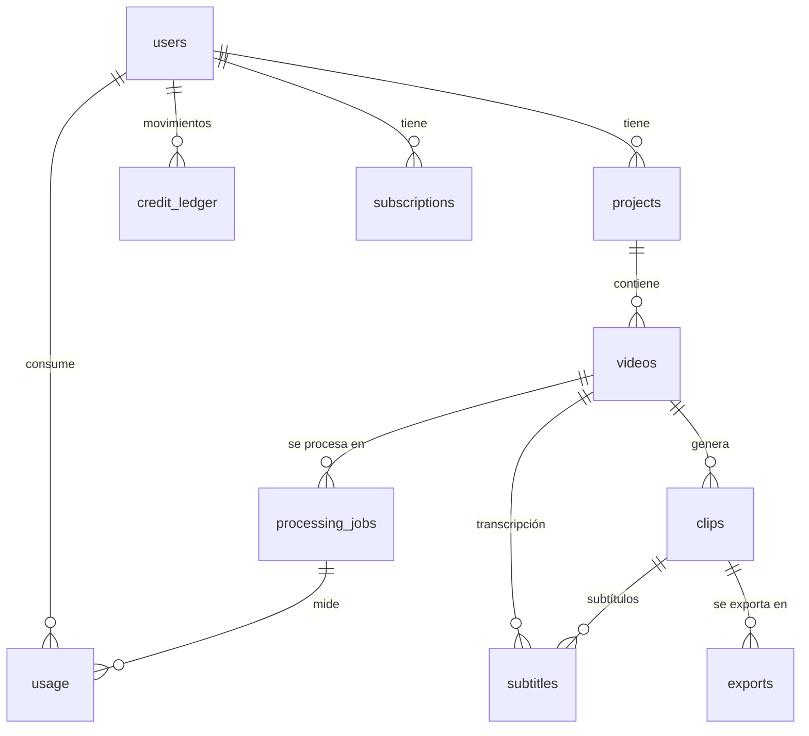

# ClipFlow — Fase 4: Base de datos

Estado: **terminada y probada en local y en CI**. La base de datos en AWS (RDS) se crea en la
Fase 5 junto con S3: las mismas migraciones se aplicarán allí.

## Tablas



| Tabla | Para qué sirve |
|---|---|
| `users` | Enlaza la cuenta de Cognito (`cognito_sub`) con los datos de ClipFlow. Sin contraseñas. |
| `projects` | Carpetas del usuario para organizar videos. |
| `videos` | Video original: estado de subida, tamaño, duración real (ffprobe), ruta en S3. **El archivo vive en S3, no aquí.** |
| `processing_jobs` | Trabajos asíncronos: `queued → processing → completed / failed / cancelled`, etapa, progreso real 0–100, intentos, clave de idempotencia, latido del worker, error para el usuario. |
| `clips` | Segmento (inicio/fin), formato (9:16…), score 0–1 y aporte de cada señal, estado (`generated / approved / discarded`), rutas del clip y thumbnail en S3. |
| `subtitles` | Archivos `.srt/.vtt/.json` en S3, del video completo o de un clip. |
| `exports` | Exportaciones finales de un clip, con fecha de expiración. |
| `usage` | Mediciones de consumo y **costo estimado** (minutos subidos/procesados, segundos de CPU, audio y tokens de OpenAI, almacenamiento, clips). Base para calcular la rentabilidad. |
| `credit_ledger` | Libro contable de créditos (ver abajo). |
| `subscriptions` | Suscripciones sin depender de un proveedor de pagos (el proveedor se conecta después). |

Definición en código: `shared/src/db/schema.ts`. SQL generado: `shared/drizzle/`.

## Seguridad dentro de la base de datos

1. **Aislamiento entre usuarios doble**
   - La API filtra todas las consultas por el usuario del token. Un proyecto ajeno responde
     404, sin revelar que existe.
   - Además, la propia base de datos **impide** mezclar datos. Las relaciones usan
     `(id, user_id)`, así que un video de A no puede quedar dentro de un proyecto de B, ni un
     clip, trabajo, exportación o subtítulo de A puede apuntar a datos de B. Esto se cumple
     aunque el código tuviera un error.
2. **Créditos a prueba de manipulación** (`credit_ledger`)
   - El saldo **no es un número editable**: es el resultado de los movimientos.
   - Solo se pueden **agregar** movimientos. Un trigger bloquea `UPDATE`, `DELETE` y `TRUNCATE`,
     incluso desde SQL directo. Los errores se corrigen con un movimiento `adjustment` o `refund`.
   - El saldo nunca puede quedar negativo (regla en la base y en el código).
   - Cobros simultáneos no pueden gastar el mismo saldo: se bloquea al usuario mientras se calcula.
   - Idempotencia: repetir el mismo cobro (misma clave) no cobra dos veces.
   - Tipos: `purchase, subscription, processing, refund, bonus, adjustment`.
3. **Reglas de datos**: el progreso va de 0 a 100, el fin de un clip es mayor que su inicio, el
   score va de 0 a 1, los tamaños son positivos y no puede haber dos trabajos con la misma clave de
   idempotencia.
4. **Registros contables protegidos**: `usage` y `credit_ledger` no se borran si se elimina un
   usuario (`ON DELETE RESTRICT`); los usuarios se desactivan con `deleted_at`.

## Migraciones (cómo se cambia la base)

Nunca se modifica la base a mano:

1. Se edita `shared/src/db/schema.ts`.
2. `npm run db:generate` crea un archivo SQL nuevo en `shared/drizzle/` (revisable en GitHub).
3. `npm run db:migrate` aplica las migraciones pendientes. Se puede ejecutar varias veces sin riesgo.

El CI **falla** si alguien cambia `schema.ts` sin generar su migración.

| Migración | Contenido |
|---|---|
| `0000_initial_schema.sql` | Todas las tablas, relaciones, índices y reglas |
| `0001_credit_ledger_append_only.sql` | Trigger que bloquea modificar o borrar créditos |

## API conectada a la base

| Ruta | Qué hace |
|---|---|
| `GET /me` | Devuelve el usuario. La primera vez lo crea en `users` (con el email leído de Cognito). |
| `GET /projects` | Lista los proyectos **del usuario** |
| `POST /projects` | Crea un proyecto (`name` 1–120 caracteres, `description` opcional) |
| `GET /projects/:id` | Ver uno (404 si no es tuyo) |
| `PATCH /projects/:id` | Renombrar o cambiar la descripción |
| `DELETE /projects/:id` | Borrar (borra también sus videos, trabajos y clips) |

## Pruebas

Se ejecutan contra **PostgreSQL real** (Docker en local, servicio de GitHub Actions en CI):

- **Base de datos (15):** se crean las 10 tablas; no se puede mezclar datos entre usuarios (video,
  trabajo, clip, exportación, subtítulo); reglas de datos; borrado en cascada; créditos (saldo,
  sin negativos, idempotencia, clave reutilizada, **5 cobros simultáneos**, bloqueo de
  UPDATE/DELETE/TRUNCATE, montos inválidos).
- **API (18):** autenticación, alta automática del usuario, CRUD de proyectos, validación, id
  malicioso, y aislamiento: otro usuario no ve, no edita, no borra y no puede hacerse pasar por
  dueño enviando `userId`.

Total del proyecto: **51 tests**.

## Cómo ejecutarlo en tu computadora

```bash
docker compose up -d        # PostgreSQL local (crea clipflow y clipflow_test)
cp .env.example .env
npm install
npm run build -w @clipflow/shared
npm run db:migrate          # crea las tablas
npm test                    # usa TEST_DATABASE_URL (base *_test, se borra en cada test)
```

> Si ya habías creado el contenedor antes de esta fase, la base `clipflow_test` no existe.
> Bórralo y créalo de nuevo con `docker compose down -v && docker compose up -d`
> (borra los datos locales).
