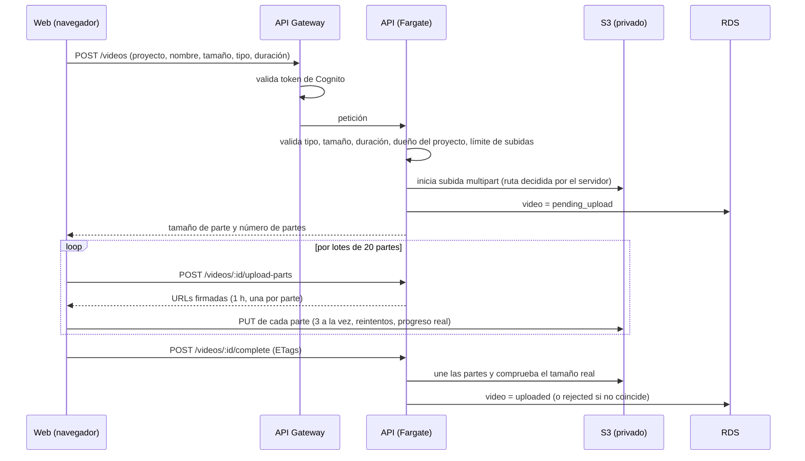

# ClipFlow — Fase 5: Subida de videos (S3) e infraestructura base

Estado: **desplegada y verificada en AWS (staging)** el 01/10/2026.

Prueba real: se creó un proyecto y se subieron videos de 50.8 MB (23:24 min) desde el celular.
Todos quedaron en S3 con estado "Subido". Una subida quedó "sin terminar" por interrumpirse
(pantalla bloqueada o pestaña cerrada). Por eso se añadió:
- un botón **Descartar** para subidas sin terminar (aborta la subida en S3 y borra el registro);
- durante la subida, la pantalla no se apaga (Wake Lock) y se muestra un aviso.

## Qué se construyó

### Flujo de subida

- **El video nunca pasa por la API**, que solo firma URLs.
- Partes de 16 MiB (más grandes en archivos enormes, máximo 10.000 partes).
- Si se cae la conexión, cada parte se reintenta hasta 4 veces con espera creciente.
- **Cancelar** aborta la subida en S3 y borra el registro. S3 limpia solo las subidas abandonadas
  a los 2 días.
- La web avisa antes de cerrar la pestaña durante una subida.

### Validaciones (en la web y otra vez en la API)

| Regla | Valor por defecto | Variable |
|---|---|---|
| Formatos | MP4, MOV, WEBM, MKV (extensión y tipo deben coincidir) | `UPLOAD_ALLOWED_MIME_TYPES` |
| Tamaño máximo | 10 GB | `UPLOAD_MAX_BYTES` |
| Duración máxima | 3 h | `UPLOAD_MAX_DURATION_SECONDS` |
| Subidas simultáneas por usuario | 3 | `UPLOAD_MAX_PENDING` |
| Tamaño final | Debe coincidir exactamente con el declarado | — |

La comprobación del **contenido real** (que sea un video de verdad) la hace el worker con
`ffprobe` en la Fase 7.

### API nueva

| Ruta | Qué hace |
|---|---|
| `GET /videos?projectId=` | Lista tus videos |
| `GET /videos/:id` | Ver uno |
| `POST /videos` | Abre la subida |
| `POST /videos/:id/upload-parts` | URLs firmadas para un lote de partes |
| `POST /videos/:id/complete` | Confirma la subida |
| `POST /videos/:id/abort` | Cancela |

### Web

- **Proyectos** (`/dashboard`): crear proyectos y ver sus videos con tamaño, duración y estado.
- **Subir video** (`/dashboard/subir`): elegir proyecto y archivo, ver tamaño y duración, barra de
  progreso real y botón de cancelar.

### Infraestructura (AWS CDK)

| Stack | Contenido |
|---|---|
| `clipflow-staging-network` | VPC en 2 zonas: subredes públicas para contenedores y aisladas para la BD. Sin NAT. Endpoint gratuito a S3. |
| `clipflow-staging-storage` | Bucket `clipflow-staging-media-<cuenta>`: privado, cifrado, solo HTTPS, CORS solo para la web, limpieza automática de `tmp/` y subidas abandonadas. |
| `clipflow-staging-database` | PostgreSQL 16 `db.t4g.micro`, 20 GB cifrados, backups 7 días, sin acceso público, contraseña generada en Secrets Manager. |
| `clipflow-staging-api` | Contenedor de la API en Fargate, detrás de API Gateway (HTTPS, valida Cognito, 20 req/s con ráfagas de 50). Logs en CloudWatch 30 días. Aplica migraciones al arrancar, con candado. |

Seguridad verificada por tests de infraestructura:
- Todas las rutas excepto `/health` exigen token.
- La contraseña de la BD llega como secreto, nunca como texto.
- El contenedor no acepta conexiones de internet.
- Los permisos de S3 se limitan a `originals/*`.
- No hay NAT Gateway.

La imagen Docker de la API (`backend/Dockerfile`) corre sin root. Incluye los certificados
de Amazon RDS para conectar con TLS verificado.

## Pruebas

**86 tests automáticos** en total. Los nuevos de esta fase:

- **Subida (13):** flujo completo, reintento idempotente de "complete", tamaño alterado → rechazado
  y borrado, partes incompletas, cancelación, tipos no permitidos, extensión que no coincide con el tipo,
  tamaño y duración máximos, límite de subidas simultáneas, partes fuera de rango.
- **Aislamiento:** otro usuario no puede subir a tu proyecto, ni ver, firmar, completar o cancelar
  tus videos.
- **Firma real de S3:** la URL queda limitada a una parte, un archivo y un tiempo.
- **Infraestructura (11):** las reglas de seguridad de arriba.

Pruebas manuales realizadas:
- El adaptador S3 real contra un emulador de S3 (moto): crear la subida, firmar las URLs, subir 3 partes
  por HTTP, unirlas, verificar el tamaño, abortar y borrar. Todo correcto.
- La API compilada igual que en la imagen Docker (dependencias de producción), arrancada con las
  variables de AWS (`DB_HOST`, `DB_USER`…): aplica migraciones, responde `/health` y rechaza
  peticiones sin token.

**No probado todavía:** la construcción de la imagen Docker (este entorno no tiene Docker; se
construye en GitHub Actions al desplegar) y la subida desde el navegador contra AWS real.

## Costos (staging)

Aproximados, en USD por mes:
- RDS: ~14.
- API en Fargate (x86, 0.25 vCPU / 0.5 GB): ~9.
- IP pública de la API: ~3.6.
- Cloud Map: ~0.6.
- Secrets Manager: ~0.4.
- CloudWatch: ~1–3.
- API Gateway, S3 y transferencia: según el uso.

**Total: unos 30 USD al mes** mientras el entorno esté encendido.

## Cómo desplegar

1. Unir a `main` el PR de esta fase.
2. GitHub → **Actions** → **Deploy** → **Run workflow** → `staging`. La primera vez tarda
   ~15–20 min (crear RDS toma lo suyo).
3. En el resumen del despliegue, copia **`ApiUrl`** (sección `clipflow-staging-api`).
4. AWS → **Amplify** → tu app → **Hosting → Environment variables** → **Manage variables** →
   agrega `NEXT_PUBLIC_API_URL` = el `ApiUrl` → **Save**. Luego **Deployments → Redeploy this
   version**, porque Next.js incluye esta variable al compilar.
5. Entra a la web → **Proyectos** → crea uno → **Subir video**.

## Cómo apagarlo para no pagar

GitHub no lo hace solo. En AWS → **CloudFormation**, borra en este orden `clipflow-staging-api`,
`clipflow-staging-database` (deja un snapshot), `clipflow-staging-storage` (borra los videos) y
`clipflow-staging-network`. Se recrean con **Deploy**.
