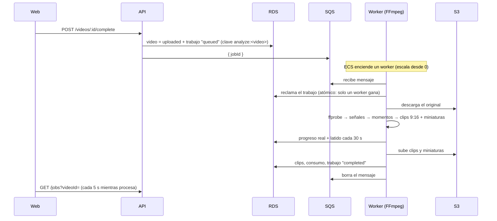

# ClipFlow — Fases 6 y 7: Cola de trabajos y procesador de video

Estado: **desplegada y verificada en AWS (staging)** el 30/09/2026.

Prueba real: se procesó un video de 23:24 min (50.8 MB) subido desde el celular. El worker arrancó
desde 0, generó los clips y la web mostró el progreso y los resultados. El PR #5 corrigió el error
"Unsupported Media Type" al descartar subidas y agregó "Procesar video" para videos anteriores.

## Cómo funciona

### Estados del trabajo

`queued → processing → completed | failed | cancelled`, con una **etapa** y un **progreso real**:

| Etapa | % | Qué pasa |
|---|---|---|
| `preparing` | 0–10 | Descarga desde S3 y verificación con `ffprobe` |
| `analyzing` | 10–45 | Una pasada de FFmpeg: volumen por segundo y cambios de escena |
| `detecting_moments` | 45–50 | Score y selección de momentos |
| `rendering_clips` | 50–95 | Recorte + formato vertical 1080x1920 + miniatura, por clip |
| `finalizing` | 95–100 | Guarda clips y consumo |

El porcentaje sale del avance real de FFmpeg (`-progress`) y de los bytes descargados. Nunca
retrocede y solo llega a 100 al completar.

### Idempotencia y reintentos

- **Un trabajo por video:** la clave `analyze:<videoId>` impide duplicados, aunque se repita el "complete".
- **Reclamo atómico:** si llegan dos mensajes iguales, solo un worker procesa (probado con 5 a la vez).
- **Latido:** si un worker se cae (no da señales en 3 min), otro puede retomar el trabajo.
- **Rutas fijas por trabajo** (`clips/<usuario>/<trabajo>/<n>.mp4`): repetir un trabajo reemplaza los
  clips, no los duplica.
- **Fallos temporales** (S3, FFmpeg, red): vuelve a la cola con espera creciente (60 s, 120 s…),
  hasta 3 intentos.
- **Fallos definitivos** (el archivo no es un video, supera la duración): `failed` con un mensaje
  claro y el video pasa a `rejected`.
- Si SQS no recibe el mensaje, el trabajo sigue en `queued` y "Reintentar" lo reenvía (a partir de 5 min).
- Tras 6 entregas fallidas, el mensaje va a la **cola de errores (DLQ)** y se activa la alarma
  `clipflow-staging-jobs-dlq-not-empty`.
- **Cancelar:** en cola es inmediato. Procesando: el worker se detiene en su siguiente latido y
  mata el proceso de FFmpeg.

### Cómo se eligen los momentos (sin IA todavía)

Señales reales calculadas con FFmpeg, por segundo:
- **audio:** volumen (RMS en dB);
- **visual:** cambios de escena.

Cada señal se normaliza entre 0 y 1. Si su variación es menor que un mínimo (3 dB para el audio),
se descarta como ruido. El score de cada ventana es el promedio ponderado con los pesos de
`shared/src/product-config.ts` y se expresa **relativo al video** (1 = el momento más intenso).
Se crean clips solo para las ventanas con score ≥ `MIN_CLIP_SCORE` (0.6), sin solaparse y hasta
`MAX_CLIPS_PER_VIDEO`. Un video plano no genera clips; esa es la respuesta honesta.

La interfaz `AIAnalysisProvider` (`shared/src/analysis/ai-provider.ts`) ya está definida: en la
Fase 8, OpenAI aportará la señal `speech`, los subtítulos y los títulos.

### Escalado y costos

- El worker (2 vCPU, 4 GB, 50 GB de disco) **está apagado cuando no hay trabajos**. ECS lo enciende
  cuando `pendientes + en proceso ≥ 1` (hasta 3 workers) y lo apaga cuando llega a 0. Como cuenta
  los mensajes en proceso, nunca apaga un worker que está trabajando.
- **Latencia:** después de un rato sin uso, el primer video puede tardar ~3–5 min en empezar
  (métrica de SQS + arranque del contenedor).
- **Costo:** ~0.10 USD por hora de procesamiento. Cada trabajo registra en `usage` los segundos de
  video, los segundos de proceso con su costo estimado y los clips generados.

### Web

- **Proyectos:** cada video muestra su etapa y su progreso real. Se actualiza cada 5 s mientras procesa.
- **Página del video** (`/dashboard/videos/<id>`):
  - progreso, **Cancelar** y **Reintentar**;
  - clips con miniatura, reproductor, tiempo, duración y score;
  - **Aprobar**, **Descartar** / **Recuperar** y **Descargar** (URL firmada de 15 min).

### Infraestructura nueva (`clipflow-staging-worker`)

- Cola SQS `clipflow-staging-jobs` (cifrada, solo HTTPS) + DLQ + alarma.
- Worker en Fargate con FFmpeg (`worker/Dockerfile`, sin root), en su propio cluster, sin
  conexiones entrantes.
- Permisos del worker: leer `originals/*`, escribir `clips/*`, `thumbnails/*`, `subtitles/*` y `tmp/*`,
  consumir la cola.
- La API ahora puede enviar a la cola y **solo leer** los resultados (para previews y descargas).

## Pruebas

**122 tests automáticos**, todos pasan. Los nuevos:

- **Trabajos (9, BD real):**
  - 5 workers reclamando a la vez: gana uno;
  - un worker caído se retoma y el viejo ya no puede escribir;
  - el progreso nunca retrocede;
  - cancelar en cola y procesando;
  - reintentos hasta agotar los intentos;
  - el fallo definitivo muestra su mensaje;
  - aislamiento entre usuarios.
- **Score (7):** momentos correctos, sin cantidad forzada, sin solapes, pesos, videos cortos, ruido
  ignorado.
- **Worker con FFmpeg real (9):**
  - un video de 40 s con audio alto en los segundos 20–26 → el clip elegido cubre ese tramo,
    en 1080x1920 y con miniatura;
  - reintento sin duplicar;
  - un archivo falso → rechazado sin reintentar;
  - un video plano → 0 clips;
  - consumidor: mensaje procesado y borrado, duplicado ignorado, mensaje inválido descartado,
    error temporal → vuelve a la cola con espera.
- **API (6 nuevos):** un trabajo por video, una sola vez en la cola; SQS caído → reenviable;
  cancelar y reintentar; clips con URLs, aprobar y descargar; aislamiento de clips y trabajos.
- **Infraestructura (5 nuevos):** DLQ con alarma, el worker empieza y escala a 0, recursos
  suficientes, sin conexiones entrantes, permisos de S3 por carpeta.

Pruebas manuales:
- Los adaptadores de S3 de la API y del worker, contra un emulador de S3: correctos.
- El worker compilado igual que en la imagen: arranca, valida su configuración y reintenta si SQS falla.

**No probado todavía:** la construcción de las imágenes Docker (se construyen en GitHub al desplegar)
y el flujo completo en AWS.

## Cómo desplegar

1. Unir a `main` el PR de estas fases.
2. GitHub → **Actions** → **Deploy** → `staging` (~10–15 min; crea la cola y el worker y actualiza la API).
3. No hace falta cambiar nada en Amplify: la web se actualiza sola al unir el PR.
4. Sube un video corto (1–3 min). Verás el progreso por etapas y luego los clips.
