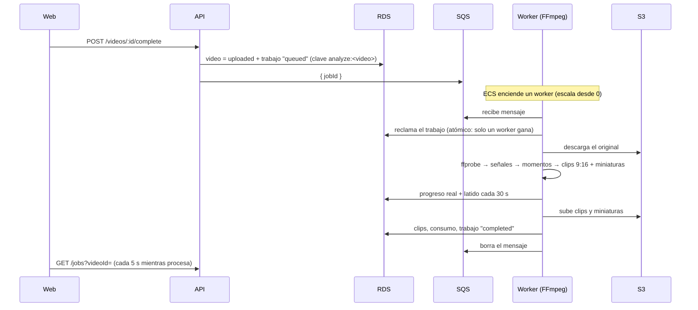

# ClipFlow — Fases 6 y 7: Cola de trabajos y procesador de video

Estado: **desplegada y verificada en AWS (staging)** el 30/09/2026.

Prueba real: se procesó un video de 23:24 min (50.8 MB) subido desde el celular. El worker arrancó
desde 0, generó los clips y la web mostró el progreso y los resultados. El PR #5 corrigió el error
"Unsupported Media Type" al descartar subidas y agregó "Procesar video" para videos anteriores.

## Cómo funciona

### Estados del trabajo

`queued → processing → completed | failed | cancelled`, con una **etapa** y un **progreso real**:

| Etapa | % | Qué pasa |
|---|---|---|
| `preparing` | 0–10 | Descarga desde S3 y verificación con `ffprobe` |
| `analyzing` | 10–45 | Una pasada de FFmpeg: volumen por segundo y cambios de escena |
| `detecting_moments` | 45–50 | Score y selección de momentos |
| `rendering_clips` | 50–95 | Recorte + formato vertical 1080x1920 + miniatura, por clip |
| `finalizing` | 95–100 | Guarda clips y consumo |

El porcentaje sale del avance real de FFmpeg (`-progress`) y de los bytes descargados. Nunca
retrocede y solo llega a 100 al completar.

### Idempotencia y reintentos

- **Un trabajo por video:** la clave `analyze:<videoId>` impide duplicados, aunque se repita el "complete".
- **Reclamo atómico:** si llegan dos mensajes iguales, solo un worker procesa (probado con 5 a la vez).
- **Latido:** si un worker se cae (no da señales en 3 min), otro puede retomar el trabajo.
- **Rutas fijas por trabajo** (`clips/<usuario>/<trabajo>/<n>.mp4`): repetir un trabajo reemplaza los
  clips, no los duplica.
- **Fallos temporales** (S3, FFmpeg, red): vuelve a la cola con espera creciente (60 s, 120 s…),
  hasta 3 intentos.
- **Fallos definitivos** (el archivo no es un video, supera la duración): `failed` con un mensaje
  claro y el video pasa a `rejected`.
- Si SQS no recibe el mensaje, el trabajo sigue en `queued` y "Reintentar" lo reenvía (a partir de 5 min).
- Tras 6 entregas fallidas, el mensaje va a la **cola de errores (DLQ)** y se activa la alarma
  `clipflow-staging-jobs-dlq-not-empty`.
- **Cancelar:** en cola es inmediato. Procesando: el worker se detiene en su siguiente latido y
  mata el proceso de FFmpeg.

### Cómo se eligen los momentos (sin IA todavía)

Señales reales calculadas con FFmpeg, por segundo:
- **audio:** volumen (RMS en dB);
- **visual:** cambios de escena.

Cada señal se normaliza entre 0 y 1. Si su variación es menor que un mínimo (3 dB para el audio),
se descarta como ruido. El score de cada ventana es el promedio ponderado con los pesos de
`shared/src/product-config.ts` y se expresa **relativo al video** (1 = el momento más intenso).
Se crean clips solo para las ventanas con score ≥ `MIN_CLIP_SCORE` (0.6), sin solaparse y hasta
`MAX_CLIPS_PER_VIDEO`. Un video plano no genera clips; esa es la respuesta honesta.

La interfaz `AIAnalysisProvider` (`shared/src/analysis/ai-provider.ts`) ya está definida: en la
Fase 8, OpenAI aportará la señal `speech`, los subtítulos y los títulos.

### Videos sin voz (gameplay, música)

Detectado en una prueba real (30/09/2026) con un gameplay de Free Fire sin voz: salió 1 solo clip con un
título inventado ("Crímenes en serie…").

**Causa:**
- Whisper "alucina" frases en audio sin habla. Esa transcripción falsa pesaba como contenido importante.
- Los disparos, de milisegundos, se diluían en el volumen promedio.

**Cambios:**
- **Señal `action` (nueva, peso 0.3):** el volumen se mide cada 0.1 s y cuenta como pico toda subida
  brusca de al menos 8 dB sobre la mediana de los 5 s anteriores, por ejemplo disparos, golpes,
  explosiones o gritos.
- **Señal `visual`:** ahora mide el movimiento continuo (suma de la puntuación de escena de cada
  fotograma), no solo los cortes bruscos.
- **Filtro de alucinaciones:** se descartan las frases que Whisper marca como probable silencio
  (`no_speech_prob > 0.6`), poco seguras (`avg_logprob < -1`) o repetitivas (`compression_ratio > 2.4`).
- **Modo "sin habla":** si queda menos del 10 % del audio (o menos de 15 s) con voz real, no se
  generan títulos ni subtítulos y el resultado se marca `no_speech`. La web lo explica.

Tests:
- un "gameplay" de 60 s con ráfagas de disparos entre los segundos 35 y 45 → el mejor clip cae ahí;
- frases alucinadas descartadas;
- modo sin habla: sin títulos, sin subtítulos, con el costo registrado.

### Encuadre vertical 9:16 (automático)

Cada clip sale en 1080x1920. **Solo se recorta cuando hace falta:**

1. **Video horizontal:** se recorta a 9:16.
   - Primero se quitan las franjas negras "quemadas". El worker toma 8 fotogramas y marca como imagen
     real las filas y columnas donde al menos un 35 % de los píxeles no son negros.
   - Luego, en cada clip, se elige la franja vertical con más movimiento y detalle, con una leve
     preferencia por el centro, en lugar de cortar siempre al centro.
   - **Si hay personas, el recorte las sigue** (ver "Encuadre que sigue caras" abajo). Sin caras,
     se usa la franja con más acción.
2. **Video vertical:** NO se recorta a 9:16.
   - **Sin franjas:** se muestra completo. Si su proporción no es exactamente 9:16, lo que falte se
     rellena de negro en vez de cortar.
   - **Con franjas laterales:** se quitan; la imagen tampoco es 9:16, así que no se pierde nada.
   - **Con una imagen horizontal y franjas arriba y abajo** (típico al descargar de TikTok): solo se
     acerca un poco (`VERTICAL_BAND_ZOOM` = 1.25). Se ve el 80 % del ancho, desplazado hacia donde
     está la acción, y lo que queda de las franjas se pinta de negro para que no se vean marcas de
     agua ni textos.
3. **Videos de celular con "marca de giro":** muchos celulares guardan el video vertical acostado
   (p. ej. 1920x1080) con una marca que indica girarlo. Ahora se leen las medidas ya giradas; antes se
   trataban como horizontales y se recortaban de más.

Historial de pruebas reales (30/09/2026):
- Primero, el clip de un video de TikTok salía con la imagen pequeña entre franjas negras y con la
  marca de agua. Se quitaron las franjas.
- Después, los videos que ya venían verticales se recortaban demasiado: la imagen horizontal del
  centro se volvía a cortar a 9:16 y se perdían dos tercios. Ahora solo se acerca un poco.

**Límite honesto:** si el original tiene poca resolución (p. ej. una imagen de 400 px de alto dentro
de un video vertical), al ampliarla se verá menos nítida. Ninguna herramienta puede recuperar
detalle que el archivo no tiene.

Tests:
- la acción a la derecha o a la izquierda mueve el recorte de un video horizontal hacia ese lado;
- un video vertical con franjas solo se acerca 1.25x, sigue la acción, y la marca de agua de la
  franja desaparece;
- un video vertical sin franjas no se recorta nada;
- un video vertical con marca de giro se reconoce como vertical;
- un video sin franjas no se recorta de más.

### Encuadre que sigue caras

En videos horizontales con personas (podcasts, entrevistas, vlogs), el recorte 9:16 sigue a quien
habla en lugar de quedarse fijo.

- **Detector:** YuNet, el modelo oficial de OpenCV (licencia MIT, 230 KB, en `worker/models/`).
  - Corre en el mismo worker con `onnxruntime-node`, solo CPU. No se llama a ninguna API ni se paga
    por imagen.
  - La telemetría de onnxruntime (que enviaría datos a Microsoft) se apaga antes de cargarlo, y
    también en la imagen Docker (`ORT_DISABLE_TELEMETRY=1`).
- **Muestreo:** 4 imágenes por segundo de cada clip, sin franjas negras y a 640 px.
  - Para ir rápido, se reducen a la mitad y se juntan de a 6 en un mosaico de 640x640: una pasada del
    modelo analiza 6 imágenes.
  - Medido: un clip de 60 s se analiza en ~2.5 s más que antes.
- **Seguimiento:** une las caras de la misma persona entre muestras y descarta "personas" de menos
  de 1 s (detecciones falsas). Un cambio de escena (la imagen cambia de golpe) empieza de cero.
- **Quién habla:**
  - Cuánto cambia la zona de la boca entre muestras, menos lo que cambia la de los ojos (movimiento
    de toda la cabeza o de la luz).
  - Se promedia en ventanas de 1.5 s y solo cuenta mientras la transcripción dice que hay voz.
  - Tras cambiar de persona se queda al menos 2 s, para no rebotar en diálogos rápidos.
- **A quién encuadrar:**
  - si el grupo cabe en el 9:16, al grupo;
  - si no, a quien habla;
  - si no se sabe, a la cara más grande (entre parecidas, la más central).
  - En escenas sin caras dentro del clip, se usa el encuadre por acción.
- **Cámara suave:**
  - no se mueve por movimientos pequeños (zona muerta de 8 % del ancho);
  - panea a lo sumo 35 % del ancho por segundo;
  - salta directo en cambios de escena o de persona;
  - nunca sale de la imagen.
  - FFmpeg recibe la trayectoria como una expresión de `t` en `crop=x='…'`. La miniatura usa la
    posición del medio del clip.
- **Interruptor:** `FACE_TRACKING_ENABLED` (en AWS, `"true"`). Con `"false"`, o si el detector falla,
  se usa el encuadre por acción; el video se procesa igual.

**Límites honestos:**
- Saber quién habla por la boca es una aproximación. Falla con caras de perfil, muy lejanas (en
  planos abiertos la boca mide pocos píxeles), bocas tapadas o voz en off. En esos casos encuadra la
  cara más destacada.
- En videos verticales no se recorta, así que no aplica.

Pruebas:
- **Detector:** encuentra a las 6 personas de una foto de la NASA de dominio público, también a
  320 px, y no inventa caras en una imagen sin personas.
- **Lógica:**
  - seguimiento, grupo, quién habla con histéresis, diálogo rápido sin rebotes;
  - cara más grande y más central, voz;
  - zona muerta, velocidad máxima, saltos, límites, escenas sin caras;
  - la expresión de FFmpeg da la misma posición que la trayectoria.
- **De punta a punta:** una cara que cambia de lado en un corte queda centrada en el clip final,
  antes y después del corte (se verifica detectando la cara en el video renderizado).
- **Con video real:** probado con un podcast de la NASA (dominio público, 720p) que alterna planos
  cerrados, planos abiertos y escenas con varias personas.

### Escalado, velocidad y costos

**Problema detectado (30/09/2026):** un video quedó varios minutos en "En cola 0 %". Las métricas de
SQS, que usaba el escalado, tardan de 1 a 5 min en reaccionar, y hasta ~15 min si la cola llevaba
horas sin uso. Luego el procesador todavía tenía que arrancar.

**Cómo funciona ahora:**

1. **La API enciende el procesador al EMPEZAR la subida** (`ecs:RunTask`), sin esperar métricas. Así
   arranca (~1 min) mientras el video sube, y al terminar la subida el trabajo empieza enseguida.
   También lo pide al encolar un trabajo: 1 procesador por trabajo en cola, hasta 3.
2. **Esos procesadores se apagan solos** tras 10 min sin trabajo (`WORKER_IDLE_EXIT_SECONDS=600`),
   así los videos seguidos empiezan al instante. Cada espera cuesta ~0.03 USD.
3. **Respaldo por métricas:** el servicio ECS sigue escalando de 0 a 3 según pendientes + en proceso.
   Se enciende con 1 pendiente (alarma de 1 min) y se apaga tras 10 min seguidos sin nada (alarma de
   10 min). Además, al empezar una subida la API deja un aviso en la cola; el worker lo mantiene
   "en proceso" hasta 15 min para que el respaldo no se apague durante la subida.
4. **Más rápido por video:**
   - worker de **4 vCPU / 8 GB**;
   - el análisis de FFmpeg, la transcripción y el análisis de imágenes corren **en paralelo**;
   - la transcripción envía hasta 3 trozos a la vez;
   - se generan **2 clips a la vez**.
5. **Web:** muestra "Encendiendo el procesador…", el tiempo transcurrido y que se puede cerrar la
   página porque el trabajo sigue en la nube.

**Permisos mínimos:** la API solo puede lanzar la definición de tarea `clipflow-<entorno>-worker` en
su cluster, listar tareas de ese cluster y pasar los roles de ese worker a ECS.

**Costo:** ~0.20 USD por hora de procesamiento (4 vCPU / 8 GB). Tarda aproximadamente la mitad que
antes, así que el costo por video es parecido. Cada trabajo registra en `usage` sus segundos de
proceso y su costo estimado.

### Web

- **Proyectos:** cada video muestra su etapa y su progreso real. Se actualiza cada 5 s mientras procesa.
- **Página del video** (`/dashboard/videos/<id>`):
  - progreso, **Cancelar** y **Reintentar**;
  - clips con miniatura, reproductor, tiempo, duración y score;
  - **Aprobar**, **Descartar** / **Recuperar** y **Descargar** (URL firmada de 15 min).

### Infraestructura nueva (`clipflow-staging-worker`)

- Cola SQS `clipflow-staging-jobs` (cifrada, solo HTTPS) + DLQ + alarma.
- Worker en Fargate con FFmpeg (`worker/Dockerfile`, sin root), en su propio cluster, sin
  conexiones entrantes.
- Permisos del worker: leer `originals/*`, escribir `clips/*`, `thumbnails/*`, `subtitles/*` y `tmp/*`,
  consumir la cola.
- La API ahora puede enviar a la cola y **solo leer** los resultados (para previews y descargas).

## Pruebas

**122 tests automáticos**, todos pasan. Los nuevos:

- **Trabajos (9, BD real):**
  - 5 workers reclamando a la vez: gana uno;
  - un worker caído se retoma y el viejo ya no puede escribir;
  - el progreso nunca retrocede;
  - cancelar en cola y procesando;
  - reintentos hasta agotar los intentos;
  - el fallo definitivo muestra su mensaje;
  - aislamiento entre usuarios.
- **Score (7):** momentos correctos, sin cantidad forzada, sin solapes, pesos, videos cortos, ruido
  ignorado.
- **Worker con FFmpeg real (9):**
  - un video de 40 s con audio alto en los segundos 20–26 → el clip elegido cubre ese tramo,
    en 1080x1920 y con miniatura;
  - reintento sin duplicar;
  - un archivo falso → rechazado sin reintentar;
  - un video plano → 0 clips;
  - consumidor: mensaje procesado y borrado, duplicado ignorado, mensaje inválido descartado,
    error temporal → vuelve a la cola con espera.
- **API (6 nuevos):** un trabajo por video, una sola vez en la cola; SQS caído → reenviable;
  cancelar y reintentar; clips con URLs, aprobar y descargar; aislamiento de clips y trabajos.
- **Infraestructura (5 nuevos):** DLQ con alarma, el worker empieza y escala a 0, recursos
  suficientes, sin conexiones entrantes, permisos de S3 por carpeta.

Pruebas manuales:
- Los adaptadores de S3 de la API y del worker, contra un emulador de S3: correctos.
- El worker compilado igual que en la imagen: arranca, valida su configuración y reintenta si SQS falla.

**No probado todavía:** la construcción de las imágenes Docker (se construyen en GitHub al desplegar)
y el flujo completo en AWS.

## Cómo desplegar

1. Unir a `main` el PR de estas fases.
2. GitHub → **Actions** → **Deploy** → `staging` (~10–15 min; crea la cola y el worker y actualiza la API).
3. No hace falta cambiar nada en Amplify: la web se actualiza sola al unir el PR.
4. Sube un video corto (1–3 min). Verás el progreso por etapas y luego los clips.
