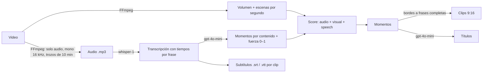

# ClipFlow — Fase 8: Análisis con IA (OpenAI)

Estado: **desplegada y verificada en AWS (staging) con OpenAI real** el 30/09/2026.

**Prueba real:** un video de **23 min** se procesó con IA sin errores (transcripción, momentos por
contenido, frases completas, subtítulos y títulos). **Costo real de OpenAI: 0.14 USD**, igual a la
estimación (23 min × 0.006 USD de transcripción + menos de 0.01 USD de análisis).

## Qué hace

1. **Transcripción** (`whisper-1`, el único modelo de OpenAI que devuelve tiempos por frase).
   Se envía **solo el audio** comprimido, en trozos de 10 min (~2.4 MB, bajo el límite de 25 MB).
2. **Análisis del contenido** (`gpt-4o-mini`): lee la transcripción y marca momentos que funcionarían
   como clips independientes (ganchos, frases fuertes, humor, emoción, datos, conclusiones), cada uno
   con una fuerza de 0 a 1. Esa fuerza es la señal **`speech`** del score, junto con **audio** y
   **visual**. Los pesos están en `shared/src/product-config.ts`.
3. **Cortes en frases completas:** cada clip mueve su inicio y su fin, como máximo 4 s, al borde de
   frase más cercano.
4. **Subtítulos:** `.srt` y `.vtt` por clip en `subtitles/`. La web los muestra sobre el video y
   permite descargar el `.srt`.
5. **Títulos:** uno por clip, en el idioma del video.

### Seguridad y robustez

- La clave vive en **Secrets Manager** (`clipflow-staging/openai-api-key`) y ECS la entrega **solo al
  worker**. La API no puede leerla (lo comprueba un test). Nunca aparece en los logs.
- Las respuestas de OpenAI se validan con esquemas. Los tiempos se limitan a la duración del video y
  la fuerza a 0–1.
- La transcripción es contenido del usuario. Por eso el prompt le indica al modelo que ignore
  instrucciones que aparezcan en ella, y la salida se valida.
- **Reintentos** ante errores temporales (429, 5xx, red), respetando `Retry-After`. Una clave inválida
  (401) no se reintenta.
- **Si la IA falla o no hay clave, el video se procesa igual** con FFmpeg. La web lo dice claramente:
  "Sin análisis de IA: …".

### Costos

Cada trabajo registra en `usage`:
- `ai_audio_seconds` con el costo de transcripción;
- `ai_input_tokens` / `ai_output_tokens` con el costo del análisis y los títulos.

Precios usados para estimar (configurables; revisar en https://openai.com/api/pricing):

| Uso | Precio |
|---|---|
| whisper-1 | 0.006 USD / minuto de audio |
| gpt-4o-mini | 0.15 USD / 1M tokens de entrada, 0.60 USD / 1M de salida |

**Ejemplo real:** un video de 23 min costó **0.14 USD** en OpenAI.

### Costo total por video (para fijar precios)

| Concepto | Por minuto de video | Video de 23 min |
|---|---|---|
| OpenAI (transcripción + análisis + títulos) | ~0.0062 USD | 0.14 USD (real) |
| Worker Fargate (2 vCPU / 4 GB, ~0.10 USD por hora de proceso) | ~0.0005–0.001 USD | ~0.01–0.02 USD (estimado) |
| S3 (guardar original + clips) y transferencia | < 0.001 USD | ~0.00 USD |
| **Total variable** | **~0.007–0.008 USD** | **~0.16 USD** |

A esto se suma el costo fijo de la infraestructura: unos 30 USD al mes por entorno.
El costo exacto de cada video queda en la tabla `usage` (`estimated_cost_usd`).

**Referencias para decidir el precio (sin pagos implementados todavía):**
- Con un precio de 0.03 USD por minuto procesado, el margen es de ~75 % sobre el costo variable.
  Un video de 23 min se cobraría ~0.69 USD.
- Para cubrir los ~30 USD fijos al mes a ese precio se necesitan ~1,300 minutos procesados al mes
  (≈ 58 videos de 23 min).
- Opción para bajar costos: `gpt-4o-mini-transcribe` cuesta la mitad (0.003 USD/min), pero **no**
  devuelve tiempos por frase, así que se perderían los subtítulos y los cortes exactos.

Límite de seguridad: `OPENAI_MAX_AUDIO_MINUTES = 180` por video.

## Pasos manuales (una vez)

### 1. OpenAI

1. Entra a https://platform.openai.com e inicia sesión.
2. **Billing**: la API funciona con saldo prepagado. Agrega crédito, por ejemplo 5–10 USD.
3. **Límite de gasto:** Settings → **Limits** → define un presupuesto mensual (p. ej. 10 USD) y una
   alerta por email.
4. **API keys** → **Create new secret key** → nombre `clipflow-staging` → **Create**. Copia la clave
   (empieza con `sk-`). Solo se muestra una vez.

**Nunca la pegues en el chat, en GitHub ni en Amplify.**

### 2. AWS (después del Deploy de esta fase)

1. Consola de AWS (región N. Virginia) → busca **Secrets Manager**.
2. Abre el secreto **`clipflow-staging/openai-api-key`**.
3. En "Secret value", pulsa **Retrieve secret value** → **Edit**.
4. Pestaña **Plaintext**: borra todo el texto y pega **solo** tu clave (`sk-...`). Sin comillas ni espacios.
5. **Save**.

El siguiente video que se procese ya usará la IA: el worker lee la clave cada vez que se enciende.

## Pruebas

**143 tests automáticos**, todos pasan. Los nuevos:

- **Proveedor OpenAI (8)**, con respuestas simuladas; no se usó tu clave:
  - formato exacto de las peticiones (modelo, `verbose_json`, tiempos por frase);
  - tiempos ajustados por trozo y costo;
  - reintentos con `Retry-After`;
  - clave inválida sin reintento;
  - rendición tras fallos de red;
  - validación y límites de la respuesta;
  - prompt con defensa contra instrucciones inyectadas;
  - títulos incompletos.
- **Pipeline con IA (3)**, con FFmpeg real y una IA de prueba:
  - el contenido importante en una parte **silenciosa** se elige gracias a la IA;
  - bordes en frases completas, títulos, subtítulos `.srt` y `.vtt`, consumo registrado;
  - si la IA falla, igual hay clips y el resultado lo indica;
  - sin clave → "desactivada".
- **Transcripción y subtítulos (6):** señal `speech`, ajuste a frases con límite, SRT y VTT exactos.
- **API:** URLs de subtítulos. **Infraestructura:** la clave es un secreto, solo del worker.

**No probado todavía:** llamadas reales a OpenAI con tu clave. Será la primera prueba después del
despliegue.
