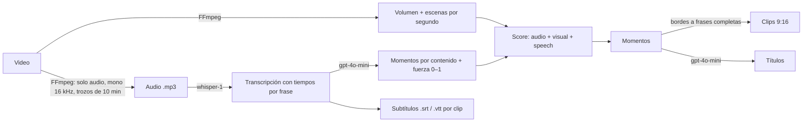

# ClipFlow — Fase 8: Análisis con IA (OpenAI)

Estado: **desplegada y verificada en AWS (staging) con OpenAI real** el 30/09/2026.

**Prueba real:** un video de **23 min** se procesó con IA sin errores (transcripción, momentos por
contenido, frases completas, subtítulos y títulos). **Costo real de OpenAI: 0.14 USD**, igual a la
estimación (23 min × 0.006 USD de transcripción + menos de 0.01 USD de análisis).

## Qué hace

1. **Transcripción** (`whisper-1`, el único modelo de OpenAI que devuelve tiempos por frase).
   Se envía **solo el audio** comprimido, en trozos de 10 min (~2.4 MB, bajo el límite de 25 MB).
2. **Análisis del contenido** (`gpt-4o-mini`): lee la transcripción y marca momentos que funcionarían
   como clips independientes (ganchos, frases fuertes, humor, emoción, datos, conclusiones), cada uno
   con una fuerza de 0 a 1. Esa fuerza es la señal **`speech`** del score, junto con **audio** y
   **visual**. Los pesos están en `shared/src/product-config.ts`.
3. **Cortes en frases completas:** cada clip mueve su inicio y su fin, como máximo 4 s, al borde de
   frase más cercano.
4. **Subtítulos:** `.srt` y `.vtt` por clip en `subtitles/`. La web los muestra sobre el video y
   permite descargar el `.srt`.
5. **Títulos:** uno por clip, en el idioma del video.

### Análisis de imágenes (experimental)

**Apagado** en todos los ambientes (`AI_VISION_ENABLED=false`) desde el 30/09/2026. Se probó en
staging: en videos largos cuesta bastante más que la transcripción (~0.37 USD por cada 30 min) y
satura el límite por minuto de OpenAI. El código sigue disponible: con `"true"` se vuelve a activar.

1. Toma **1 fotograma cada 3 s**, sin franjas negras. En videos largos se espacian más: máximo
   600 fotogramas por video.
2. Los junta en **hojas de 3x3** (1536x864). OpenAI cobra una imagen por cada 9 fotogramas.
3. `gpt-4o-mini`, en detalle alto, puntúa cada fotograma de 0 a 1 (kills, avisos en pantalla, jugadas,
   reacciones; menús y pantallas de carga ≈ 0) y le pone una etiqueta corta.
4. Esa puntuación es la señal **`vision`** (peso 0.35). Si el clip no tiene título por voz, usa la
   etiqueta del mejor fotograma, por ejemplo "Eliminación doble".
5. El costo se calcula con los **tokens reales** que devuelve OpenAI y se guarda por trabajo
   (`processing_jobs.result.costs` y la tabla `usage`, con `details.kind = "vision"`). **No se muestra
   en la web**: el costo de OpenAI se consulta en platform.openai.com → Usage.

Referencia para calcular el costo antes de probar (verificar con el valor real):
- un video de 23 min tiene ~460 fotogramas → ~52 imágenes;
- según la documentación de OpenAI, `gpt-4o-mini` cobra una imagen en detalle alto como 85 tokens +
  170 por cada bloque de 512 px;
- el resultado real depende de cómo OpenAI escale cada imagen. Por eso ClipFlow registra lo que
  OpenAI reporta.

### Videos sin habla

Si Whisper no encuentra voz real, porque descarta las frases alucinadas (ver `docs/fase-6-7-procesamiento.md`),
el resultado es `no_speech`: sin análisis de contenido, sin títulos y sin subtítulos. Los clips se
eligen por acción, volumen y movimiento. La transcripción se paga igual (0.006 USD/min).

### Seguridad y robustez

- La clave vive en **Secrets Manager** (`clipflow-staging/openai-api-key`) y ECS la entrega **solo al
  worker**. La API no puede leerla (lo comprueba un test). Nunca aparece en los logs.
- Las respuestas de OpenAI se validan con esquemas. Los tiempos se limitan a la duración del video y
  la fuerza a 0–1.
- La transcripción es contenido del usuario. Por eso el prompt le indica al modelo que ignore
  instrucciones que aparezcan en ella, y la salida se valida.
- **Reintentos** ante errores temporales (429, 5xx, red), respetando `Retry-After`. Una clave inválida
  (401) no se reintenta.
- **Si la IA falla o no hay clave, el video se procesa igual** con FFmpeg. La web lo dice claramente:
  "Sin análisis de IA: …".

### Errores de OpenAI y límite por minuto

**Detectado en una prueba real (30/09/2026):** en un video de 30 min la web decía "El análisis con IA
falló", sin el motivo, y los clips se eligieron solo por audio y escenas.

- **Causa probable:** el análisis de imágenes (experimental) mandaba 3 hojas a la vez.
  - En gpt-4o-mini cada hoja en `detail: high` cuenta como ~37 mil tokens: 2,833 + 5,667 por cada
    bloque de 512 px, y son 6 bloques.
  - 30 min son ~67 hojas: ~2.5 millones de tokens (~0.37 USD).
  - Eso llena el límite de tokens por minuto de la cuenta (en el nivel 1 de OpenAI, 200 mil por
    minuto para gpt-4o-mini).
  - Justo a la vez salía el análisis de texto, que elige los momentos. OpenAI lo rechazaba con 429 y,
    tras 4 intentos en ~30 s, el análisis se daba por perdido.
- **Otra posibilidad con el mismo síntoma:** que la cuenta se quedara sin saldo o llegara a su límite
  de gasto.

Cambios:
- **El motivo real se ve en la web**, por ejemplo:
  - "falló la transcripción: Tu cuenta de OpenAI no tiene saldo o llegó a su límite de gasto";
  - "falló el análisis de momentos: OpenAI limitó las solicitudes por minuto de tu cuenta".
  - Solo se usan mensajes propios y el código de error de OpenAI, nunca el texto de su respuesta.
- **Sin saldo (`insufficient_quota`) no se reintenta:** no se va a arreglar solo.
- **Límite por minuto (429):**
  - hasta 8 intentos;
  - cada espera es lo que indica OpenAI (`retry-after-ms`, `retry-after`,
    `x-ratelimit-reset-tokens`/`-requests`), con un máximo de 60 s por espera.
  - Los errores de red y 5xx siguen con 4 intentos.
- **Prioridad al análisis de texto:** las hojas de imágenes se preparan en paralelo, pero no se envían
  a OpenAI hasta que termina la transcripción y el análisis de momentos.
- **Las imágenes van de a 2, con tiempo máximo:** tienen 3 min (`budgetSeconds`) para empezar hojas.
  Lo que no alcance se omite y el resultado dice "parcial: se analizaron N de M grupos". Así un video
  largo no espera de más.

**Dónde ver el detalle en AWS:** CloudWatch → Log groups → `/clipflow/staging/worker` → buscar "IA no disponible"
o "análisis de imágenes no disponible". El registro incluye el paso, el código HTTP y el código de
error de OpenAI.

### Costos

Cada trabajo registra en `usage`:
- `ai_audio_seconds` con el costo de transcripción;
- `ai_input_tokens` / `ai_output_tokens` con el costo del análisis y los títulos.

Precios usados para estimar (configurables; revisar en https://openai.com/api/pricing):

| Uso | Precio |
|---|---|
| whisper-1 | 0.006 USD / minuto de audio |
| gpt-4o-mini | 0.15 USD / 1M tokens de entrada, 0.60 USD / 1M de salida |

**Ejemplo real:** un video de 23 min costó **0.14 USD** en OpenAI.

### Costo total por video (para fijar precios)

| Concepto | Por minuto de video | Video de 23 min |
|---|---|---|
| OpenAI (transcripción + análisis + títulos) | ~0.0062 USD | 0.14 USD (real) |
| Worker Fargate (2 vCPU / 4 GB, ~0.10 USD por hora de proceso) | ~0.0005–0.001 USD | ~0.01–0.02 USD (estimado) |
| S3 (guardar original + clips) y transferencia | < 0.001 USD | ~0.00 USD |
| **Total variable** | **~0.007–0.008 USD** | **~0.16 USD** |

A esto se suma el costo fijo de la infraestructura: unos 30 USD al mes por entorno.
El costo exacto de cada video queda en la tabla `usage` (`estimated_cost_usd`).

**Referencias para decidir el precio (sin pagos implementados todavía):**
- Con un precio de 0.03 USD por minuto procesado, el margen es de ~75 % sobre el costo variable.
  Un video de 23 min se cobraría ~0.69 USD.
- Para cubrir los ~30 USD fijos al mes a ese precio se necesitan ~1,300 minutos procesados al mes
  (≈ 58 videos de 23 min).
- Opción para bajar costos: `gpt-4o-mini-transcribe` cuesta la mitad (0.003 USD/min), pero **no**
  devuelve tiempos por frase, así que se perderían los subtítulos y los cortes exactos.

Límite de seguridad: `OPENAI_MAX_AUDIO_MINUTES = 180` por video.

## Pasos manuales (una vez)

### 1. OpenAI

1. Entra a https://platform.openai.com e inicia sesión.
2. **Billing**: la API funciona con saldo prepagado. Agrega crédito, por ejemplo 5–10 USD.
3. **Límite de gasto:** Settings → **Limits** → define un presupuesto mensual (p. ej. 10 USD) y una
   alerta por email.
4. **API keys** → **Create new secret key** → nombre `clipflow-staging` → **Create**. Copia la clave
   (empieza con `sk-`). Solo se muestra una vez.

**Nunca la pegues en el chat, en GitHub ni en Amplify.**

### 2. AWS (después del Deploy de esta fase)

1. Consola de AWS (región N. Virginia) → busca **Secrets Manager**.
2. Abre el secreto **`clipflow-staging/openai-api-key`**.
3. En "Secret value", pulsa **Retrieve secret value** → **Edit**.
4. Pestaña **Plaintext**: borra todo el texto y pega **solo** tu clave (`sk-...`). Sin comillas ni espacios.
5. **Save**.

El siguiente video que se procese ya usará la IA: el worker lee la clave cada vez que se enciende.

## Pruebas

**143 tests automáticos**, todos pasan. Los nuevos:

- **Proveedor OpenAI (8)**, con respuestas simuladas; no se usó tu clave:
  - formato exacto de las peticiones (modelo, `verbose_json`, tiempos por frase);
  - tiempos ajustados por trozo y costo;
  - reintentos con `Retry-After`;
  - clave inválida sin reintento;
  - rendición tras fallos de red;
  - validación y límites de la respuesta;
  - prompt con defensa contra instrucciones inyectadas;
  - títulos incompletos.
- **Pipeline con IA (3)**, con FFmpeg real y una IA de prueba:
  - el contenido importante en una parte **silenciosa** se elige gracias a la IA;
  - bordes en frases completas, títulos, subtítulos `.srt` y `.vtt`, consumo registrado;
  - si la IA falla, igual hay clips y el resultado lo indica;
  - sin clave → "desactivada".
- **Transcripción y subtítulos (6):** señal `speech`, ajuste a frases con límite, SRT y VTT exactos.
- **API:** URLs de subtítulos. **Infraestructura:** la clave es un secreto, solo del worker.

**No probado todavía:** llamadas reales a OpenAI con tu clave. Será la primera prueba después del
despliegue.

## Análisis de momentos por partes (02/10/2026)

**Qué pasó:** con un video de Kick de 2 h 30 min, la transcripción salió bien (Whisper cobró ~0,90 USD:
150 min × 0,006 USD), pero el análisis de momentos falló con "OpenAI devolvió JSON inválido".
- **Causa:** toda la transcripción iba en un solo pedido. Con tanto texto, la respuesta se cortaba por
  largo y el JSON quedaba a medias.
- **Efecto:** al fallar, también se descartaba la transcripción ya pagada, así que los clips salían sin
  subtítulos ni títulos.

**Arreglo:**
- **Por partes:** el análisis va en partes de 20 min, con 90 s de solape para no cortar momentos en el
  borde.
  - Se analizan 3 partes a la vez y como máximo 8 momentos por parte.
  - La respuesta tiene un tope de 4000 tokens.
  - Si dos momentos se pisan más de la mitad, queda el más fuerte.
- **Reintento:** si una parte llega cortada o con JSON roto, se reintenta una vez. Si sigue fallando, se
  usan las demás partes. Solo falla si fallan todas.
- **Se conserva la transcripción:** si falla el análisis después de transcribir, igual se generan
  subtítulos, títulos y la transcripción completa, y su costo se registra.
  - La web lo dice: "La IA no pudo elegir los momentos… los subtítulos y la transcripción sí están".

**Costo de la transcripción:** Whisper (`whisper-1`) cuesta 0,006 USD por minuto, unos 0,36 USD por hora
de video.
- Los modelos `gpt-4o-mini-transcribe` cuestan la mitad, pero no dan los tiempos por frase y palabra
  que necesitan los subtítulos. Por eso se mantiene Whisper.

## Transcripción guardada por video (02/10/2026)

Antes, "Reintentar" o volver a procesar el mismo video (por ejemplo, con otra duración de clip)
transcribía de nuevo y se pagaba otra vez.

**Dónde se guarda:** en el mismo bucket privado y cifrado de S3, en `transcripts/<usuario>/<video>/openai-whisper-1.json`.
Guarda los segmentos con los tiempos de cada palabra, el idioma y el tramo de audio que cubre.

**Por qué no se mezcla con otras:**
- La ruta lleva el código único del **usuario** y del **video**, y el **proveedor y modelo** en el nombre.
- Se reutiliza solo si cubre el **mismo tramo de audio** (`OPENAI_MAX_AUDIO_MINUTES`). Si no, se
  transcribe de nuevo y se reemplaza.
- Si el archivo no existe o no se puede leer, se transcribe normalmente. Si no se puede guardar, solo se
  registra en el log y el trabajo sigue.
- **Se borra con el video,** y también al borrar su proyecto.

**El mismo enlace importado otra vez (arreglo del 02/10/2026):**
- Importar de nuevo el mismo enlace crea **otro video** en ClipFlow, así que al principio no encontraba la
  transcripción y se volvía a pagar. Así se probó en staging.
- Ahora, si el video no tiene transcripción propia, se busca la de los videos anteriores **del mismo
  usuario** con el **mismo enlace** (los 5 más recientes), con las mismas condiciones de modelo y tramo
  de audio.
- Si se encuentra, se guarda una copia para el video nuevo, que se borra con él.
- Nunca se usa la transcripción de otro usuario, aunque haya importado el mismo enlace.
- Las transcripciones hechas **antes** del despliegue del PR #28 no se guardaron: esas se pagan una vez
  más, la primera vez.

**Permisos:**
- El worker puede leer y escribir en `transcripts/*`.
- La API puede leer y borrar en `transcripts/*`, para la limpieza al eliminar.

**Costo:**
- Una transcripción de 2,5 h pesa 1–3 MB; en S3 son ~0,00007 USD al mes.
- Cada reutilización ahorra la transcripción entera (~0,90 USD en un video de 2,5 h).
- En el resultado del trabajo, `costs.transcriptionUsd` queda en 0 cuando se reutiliza, y el log dice
  "transcripción reutilizada (sin costo)".

## Volver a analizar con IA (03/10/2026)

Si un video terminó **sin análisis de IA** (la IA falló o faltaba la clave), la página del video muestra
el botón **«Volver a analizar con IA»**.
- Usa el **video ya guardado en S3**: no se vuelve a pegar el enlace ni a descargar.
- Si la transcripción se había hecho, **se reutiliza la guardada**: solo se paga el análisis de texto.
- Reinicia el mismo trabajo (`POST /jobs/:id/retry`): los clips nuevos reemplazan a los anteriores.
- No aparece si el video no tiene habla o audio (volver a analizarlo no cambiaría nada), ni en
  «Descargar solo el video».
