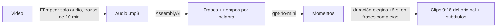

# Transcripción con AssemblyAI y duración obligatoria de los clips

Fecha: 06/10/2026.

## Qué cambia

- **Transcripción:** la hace **AssemblyAI** y no tiene respaldo. Da la transcripción completa del video,
  con frases y tiempos por palabra, y detecta el idioma solo. Antes la hacía Whisper de OpenAI.
- **Elegir momentos y títulos:** sigue haciéndolo **GPT de OpenAI** (`gpt-4o-mini`), con la transcripción.
- **Se quitaron Groq, Gemini y la página interna de comparación.**
- **Sin tope diario:** cada usuario usa los minutos de su plan cuando quiera.

## Cómo funciona la transcripción

Por cada trozo de audio de 10 minutos:
1. Se sube el audio a AssemblyAI (`/v2/upload`).
2. Se pide la transcripción (`/v2/transcript`) con `speech_models: ["universal-3-5-pro", "universal-2"]`
   y `language_detection: true`.
3. Se espera a que termine.
4. Se leen las frases con sus palabras (`/v2/transcript/{id}/sentences`).
5. **Se borra la transcripción de AssemblyAI.** La copia de ClipFlow queda en S3, como antes.

Las frases de más de 15 s se parten: en una coma después de los 8 s, o a los 15 s.

Si AssemblyAI falla:
- **Temporal** (red, saturado, error 5xx): el trabajo se reintenta más tarde.
- **Otro error** (clave inválida, sin saldo): los clips se eligen sin IA (por sonido, movimiento y chat)
  y el motivo queda en `processing_jobs.result.aiReason`.

**Costo:** unos 0,21 USD por hora de audio (Universal-3.5 Pro), es decir ~0,0035 USD por minuto.
Whisper costaba 0,006 USD por minuto. Se configura con `ASSEMBLYAI_COST_PER_HOUR_USD`.
Verifica el precio actual en https://www.assemblyai.com/pricing.

## Duración obligatoria

Si el usuario pide clips de N segundos, **cada clip dura entre N−5 y N+5 s** (60 s → entre 55 y 65 s).

1. A GPT se le pide ese rango.
2. Después, cada momento se ajusta con la transcripción (`fitToSentences`):
   - empieza al inicio de la frase donde arranca la idea;
   - si es corto, se alarga con las frases que siguen; si es largo, se recorta en un final de frase;
   - si no hay ningún corte en frases con ese largo, **se descarta** y entra el siguiente momento.
3. Si no hay habla (por ejemplo, gameplay), el clip se ajusta a la medida, sin salirse del video.
4. Si el video es más corto que el mínimo, el clip es el video entero.

## Pasos manuales

1. Crea la clave en **assemblyai.com → Dashboard → API Keys**. Las cuentas nuevas traen saldo de prueba.
2. Fusiona el PR y corre **Actions → Deploy → staging**. Esto crea el secreto `clipflow-staging/assemblyai-api-key`
   con un valor de relleno.
3. En la consola de AWS ve a **Secrets Manager → `clipflow-staging/assemblyai-api-key` → Retrieve secret value → Edit**.
   Elige **Plaintext**, borra el relleno, pega tu clave y guarda.

**Hasta que pegues la clave, los clips se hacen sin IA.** El worker no transcribe con el valor de relleno.
Nunca pegues la clave en GitHub ni en el chat.

Los secretos de Groq y Gemini se borran solos con el despliegue.
